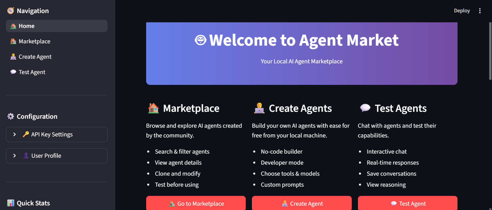

# 📸 How to Add Your Screenshot to the README

## ✅ Quick Steps

### 1. **Save Your Screenshot**
   - Right-click on the screenshot you took
   - Save it as: `agent-market-home.png`
   - Or take a new screenshot:
     - Press `Windows + Shift + S` (Windows)
     - Or `Cmd + Shift + 4` (Mac)
     - Capture the home page of your app

### 2. **Move to Screenshots Folder**
   - Move/Copy `agent-market-home.png` to the `screenshots/` folder
   - The folder should now be open in File Explorer!

### 3. **Verify**
   - Check that the file is named exactly: `agent-market-home.png`
   - The README will automatically show it!

---

## 📁 File Location

```
ai agent platform builder/
└── screenshots/
    └── agent-market-home.png  ← Save your screenshot here!
```

---

## ✅ Current Status

Your README is already configured! Just add the screenshot file:

```markdown

```

Once you save the screenshot, it will appear in:
- GitHub README
- Gumroad product page (copy from screenshots folder)
- Product Hunt listing
- Social media posts

---

## 🎯 Optional: Take More Screenshots

For a professional product page, also capture:

1. **Marketplace** - Browse agents page
2. **Create Agent** - Agent builder form
3. **Chat Interface** - Testing an agent
4. **Settings** - API key configuration

Save them as:
- `marketplace.png`
- `create-agent.png`
- `chat-interface.png`
- `api-settings.png`

Then uncomment the lines in README.md (lines 211, 215, 219)!

---

## 🚀 Next Steps

After adding screenshots:
1. View your README on GitHub (or in VS Code preview)
2. Screenshots make your product 10x more appealing!
3. Use these same images for Gumroad, Product Hunt, Twitter, etc.

**Delete this file once you've added your screenshots!**

