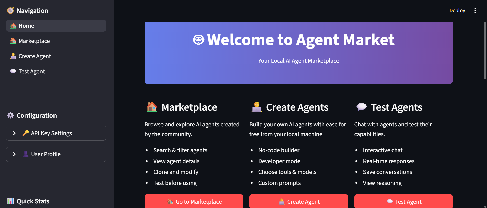

# 🤖 Agent Market

**Create, Modify & Explore AI Agents**

A local, open-source agent marketplace where anyone can build, modify, and test AI agents powered by Agno and GroqCloud.

[](https://www.python.org/downloads/)
[](https://streamlit.io)
[](https://agno.dev)
[](https://console.groq.com)

## 📸 Preview


*Your Local AI Agent Marketplace - Browse, create, and test AI agents from your desktop*

---

## 🧠 What is Agent Market?

Agent Market is **the HuggingFace of AI Agents, but local and customizable**. It combines:

- 🏪 **A Marketplace** – Browse, test, and fork existing agents
- 🛠️ **An Agent Builder** – Create new agents (no-code or code-based)
- 💬 **A Chat Sandbox** – Test agents live with real conversations
- 💾 **Local Storage** – All data saved locally (`/data/agents.json`)
- ⚡ **Blazing Fast** – Powered by GroqCloud's LPU™ (up to 750+ tokens/second!)

Whether you're a developer or non-developer, you can:

- 🧩 **Explore** ready-made agents
- 🧑‍💻 **Build** new ones using tools or code
- ⚙️ **Tweak** or extend existing ones
- 💬 **Chat/test** before publishing
- 🔄 **Clone** and modify any agent
- 🆓 **Use for FREE** with generous GroqCloud limits

---

## ✨ Features

### 🧠 Agent Builder
- **Dual Mode**: Toggle between no-code form builder and JSON developer mode
- **Tool Selection**: Choose from predefined tools (web search, stock data, file ops, calculator)
- **Model Selector**: Select from GroqCloud models (Llama 3.3 70B, Mixtral, Gemma 2, etc.)
- **Custom Prompts**: Define agent personality and behavior

### 💬 Chat Interface
- **Interactive Testing**: Chat with agents in real-time
- **Conversation History**: Keep track of all interactions
- **Reasoning Display**: View agent's thought process (optional)
- **Save Chats**: Export conversations for later reference

### 🗂️ Marketplace
- **Browse All Agents**: View prebuilt and user-made agents
- **Agent Profiles**: See name, description, tools, author for each agent
- **Clone/Modify**: Fork any agent to create your own version
- **Search & Filter**: Find agents by name, author, tags, or tools

### 💾 Local Storage
- **JSON-based**: Simple, human-readable storage
- **No Database**: Everything in `data/agents.json`
- **Portable**: Easy to backup and share

### 📦 Prebuilt Agents
6 ready-to-use agents included:
- 🔍 **Research Analyst** – Web research with DuckDuckGo search
- ✍️ **Content Wizard** – Blog writing and content creation
- 💻 **Code Assistant** – Python debugging and coding help
- 💰 **Stock Market Analyst** – Real-time stock data & market analysis (NEW!)
- 🪙 **Crypto Scout** – Cryptocurrency market tracking
- 📧 **Email Helper** – Fast email drafting with smaller model

---

## 🚀 Quick Start

### Installation

```bash
# Clone or download the repository
cd agent-market

# Install dependencies
pip install -r requirements.txt

# Set your FREE GroqCloud API key
export GROQ_API_KEY="your-api-key-here"
```

**Get Your FREE API Key:**
1. Visit [console.groq.com](https://console.groq.com)
2. Sign up (free)
3. Generate an API key
4. Copy and set as environment variable

### Run the Application

```bash
streamlit run app.py
```

The app will open in your browser at `http://localhost:8501`

---

## 📁 Project Structure

```
agent-market/
│
├── app.py                          # Main Streamlit app (home page)
│
├── pages/                          # Streamlit pages (auto-detected)
│   ├── 1_🏠_Marketplace.py         # Browse agents
│   ├── 2_🧑‍💻_Create_Agent.py      # Build new agents
│   └── 3_💬_Test_Agent.py          # Chat with agents
│
├── core/
│   ├── agent_manager.py            # CRUD operations for agents
│   ├── runner.py                   # Agent execution via Agno
│   ├── groq_integration.py         # GroqCloud API integration
│   └── tools/
│       ├── web_search.py           # DuckDuckGo search (built-in)
│       ├── summarize.py            # Text summarization
│       ├── file_ops_agno.py        # File operations (Agno compatible)
│       └── math_tool_agno.py       # Calculator (Agno compatible)
│
├── ui/
│   └── components/
│       ├── agent_card.py           # Agent display card
│       ├── chat_box.py             # Chat interface
│       └── tool_selector.py        # Tool selection UI
│
├── data/
│   ├── agents.json                 # All agents (auto-created)
│   ├── example_agents.json         # Prebuilt agents
│   └── chats/                      # Saved conversations
│
├── requirements.txt
└── README.md
```

---

## 🎯 Usage Guide

### 1️⃣ Set Up API Key (FREE!)

For demo mode, no API key is needed. For real AI responses:

1. Get a **FREE** API key from [console.groq.com](https://console.groq.com)
2. Set it in the sidebar or as an environment variable:
   ```bash
   export GROQ_API_KEY="your-key-here"
   ```
3. Enjoy **ultra-fast** inference (up to 750+ tokens/second!)
4. Generous **free tier** with high rate limits

### 2️⃣ Explore the Marketplace

- Browse existing agents
- Search by name, author, or tools
- Click **"Try Agent"** to test
- Click **"Clone/Edit"** to modify

### 3️⃣ Create Your First Agent

**No-Code Mode** 🧩
1. Go to "Create Agent" page
2. Fill in the form:
   - Agent name
   - Description
   - Select model
   - Choose tools
   - Write system prompt
3. Click "Save Agent"

**Developer Mode** 💻
1. Switch to Developer Mode
2. Edit JSON configuration:
   ```json
   {
     "name": "My Agent",
     "author": "Your Name",
     "description": "What it does",
     "model": "grok-beta",
     "tools": ["WebSearchTool"],
     "prompt": "You are a helpful assistant..."
   }
   ```
3. Click "Save Agent"

### 4️⃣ Test Your Agent

1. Go to "Test Agent" page
2. Select your agent
3. Start chatting!
4. Toggle "Show Reasoning" to see thought process
5. Save interesting conversations

---

## 📸 Feature Screenshots

### 🏠 Home Dashboard


### 🏪 Agent Marketplace
Browse, search, and explore all available agents.
<!--  -->

### 🧑‍💻 Agent Builder (No-Code)
Create custom AI agents without writing any code.
<!--  -->

### 💬 Interactive Chat
Test your agents in real-time with full conversation history.
<!--  -->

> **Note**: Take more screenshots and save them in the `screenshots/` folder to showcase all features!

---

## 🧰 Available Tools

### 🔍 Web Search Tool
Search the web for current information using **DuckDuckGo**.

**Built-in**: Agno includes DuckDuckGo search by default - no extra setup needed!
- Fast, privacy-focused web search
- Returns relevant results with summaries
- No API key required

### 📝 Summarize Tool
Condense long texts into concise summaries.

**AI-Powered**: The agent itself handles summarization intelligently using its language model capabilities. No additional tools needed!

### 📁 File Operations Tool
Read, write, and manage files safely.

**Usage**:
- `read:filepath` – Read a file
- `write:filepath:content` – Write to a file
- `list:directory` – List directory contents

### 🧮 Calculator Tool
Perform mathematical calculations and evaluate expressions.

**Supported**: Basic arithmetic, trigonometry, logarithms, constants (pi, e, etc.)

### 💰 Stock Market Tool (NEW!)
Get real-time financial data using **Yahoo Finance**.

**Built-in with Agno**:
- Real-time stock prices
- Company information
- Analyst recommendations
- Financial fundamentals
- Historical data

---

## 🔧 Configuration

### Models

Available GroqCloud models (all FREE!):
- `llama-3.3-70b-versatile` – Most capable Llama model (recommended)
- `llama-3.1-70b-versatile` – Previous generation, still powerful
- `llama-3.1-8b-instant` – Ultra-fast for simple tasks
- `mixtral-8x7b-32768` – Mixture of experts with 32k context
- `gemma2-9b-it` – Google's efficient model

### Storage

All data is stored in `data/agents.json`:

```json
[
  {
    "id": "agent_001",
    "name": "Research Analyst",
    "author": "AgentMarket",
    "description": "A powerful research assistant",
    "model": "llama-3.3-70b-versatile",
    "tools": ["WebSearchTool", "SummarizeTool"],
    "prompt": "You are a professional researcher...",
    "created_at": "2025-10-22"
  }
]
```

---

## 🛠️ Customization

### Adding Custom Tools

With Agno, creating custom tools is simple:

1. Create a new file in `core/tools/my_tool_agno.py`:

```python
def get_my_custom_tool():
    """Get my custom tool for Agno"""
    
    def my_tool(input: str) -> str:
        """
        Description of what the tool does.
        
        Args:
            input: What the tool expects
        
        Returns:
            Result of the operation
        """
        # Your logic here
        return "Result"
    
    return my_tool
```

2. Register in `core/runner.py` tool registry:

```python
TOOL_REGISTRY = {
    ...
    'MyCustomTool': None,  # Add entry
}
```

3. Add tool instantiation in `get_tool_instances()`:

```python
elif tool_name == 'MyCustomTool':
    from core.tools.my_tool_agno import get_my_custom_tool
    tools.append(get_my_custom_tool())
```

4. Update `ui/components/tool_selector.py` to show in UI.

### Custom Models

To add support for other models, edit `core/groq_integration.py`:

```python
AVAILABLE_MODELS = {
    "your-model-name": {
        "name": "Your Model Display Name",
        "description": "Description",
        "provider": "Provider"
    }
}
```

**Note**: GroqCloud supports multiple models. Check [console.groq.com](https://console.groq.com) for the latest available models.

---

## 📊 Example Agents

### Research Analyst
```json
{
  "name": "Research Analyst",
  "model": "llama-3.3-70b-versatile",
  "tools": ["WebSearchTool", "SummarizeTool"],
  "prompt": "You are a professional researcher..."
}
```

### Stock Market Analyst (NEW!)
```json
{
  "name": "Stock Market Analyst",
  "model": "llama-3.3-70b-versatile",
  "tools": ["YFinanceTool", "WebSearchTool"],
  "prompt": "You are a financial market analyst..."
}
```

### Code Assistant
```json
{
  "name": "Code Assistant",
  "model": "llama-3.3-70b-versatile",
  "tools": ["FileOpsTool", "MathTool"],
  "prompt": "You are an expert Python developer..."
}
```

---

## 🤝 Contributing

Contributions are welcome! Here's how:

1. Fork the repository
2. Create a feature branch
3. Make your changes
4. Test thoroughly
5. Submit a pull request

### Development Setup

```bash
# Install development dependencies
pip install -r requirements.txt

# Run with hot reload
streamlit run app.py --server.runOnSave true
```

---

## 📝 Roadmap

- [ ] ui upgrade to nextjs/vite
- [ ] Import/export agent configurations
- [ ] payment options 
- [ ] Agent versioning
- [ ] Usage analytics
- [ ] Cloud sync (optional)
- [ ] Agent marketplace sharing 
- [ ] Custom model integration
- [ ] Advanced tool builder 
- [ ] more real use case Agent templates
- [ ] docker integration and hosting


---

## ❓ FAQ

**Q: Do I need an API key?**
A: For demo mode, no. For real AI responses, yes - get a FREE key from [console.groq.com](https://console.groq.com).

**Q: Why GroqCloud?**
A: GroqCloud offers ultra-fast inference (750+ tokens/sec), generous free tier, multiple models, and is super easy to use!

**Q: Where is data stored?**
A: Locally in `data/agents.json` and `data/chats/`. 100% private and offline.

**Q: Can I use other AI providers?**
A: The architecture supports it! You'd need to modify `groq_integration.py` and `runner.py` to add new providers.

**Q: Is this production-ready?**
A: This is an MVP/prototype. For production, add authentication, rate limiting, error handling, and testing.

**Q: How do I backup my agents?**
A: Simply copy the `data/` folder.

---

## 📄 License

This project is open source. Feel free to use, modify, and distribute.

---

## 🙏 Acknowledgments

Built with:
- [Streamlit](https://streamlit.io) – Beautiful web framework
- [Agno](https://agno.dev) – Modern AI agent framework
- [GroqCloud](https://groq.com) – Ultra-fast AI inference on LPU™
- [DuckDuckGo](https://duckduckgo.com) – Privacy-focused web search
- [Yahoo Finance](https://finance.yahoo.com) – Real-time stock data

---

## 📧 Support

For issues, questions, or suggestions:
- Open an issue on GitHub
- Check the FAQ above
- Review the documentation

---

**🎉 Happy Agent Building!**

*"The HuggingFace of AI Agents, but offline and customizable."*

